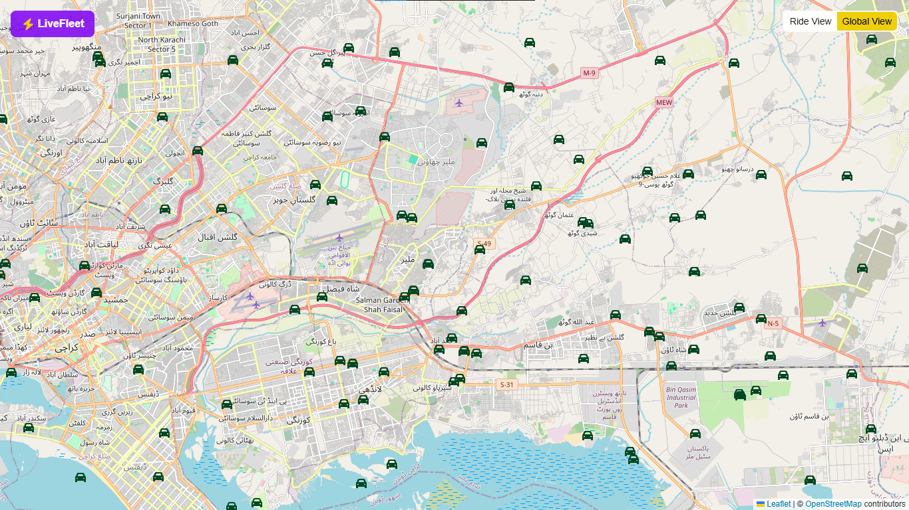

# 🗺️ LiveFleet - Scalable Real-Time Geospatial Tracking

## 📋 Overview

- 🐳 **Decoupled & Dockerized** microservice architecture:
    - 🖥️ **Frontend**
    - ⚙️ **API Server**
    - 📡 **Web Socket Ingestion Server**
    - 🗄️ **Redis**
    - 🌐 **NGINX Reverse Proxy**
    - ⌛ **Workers**
    - 🏎️ **Drivers Simulator**

---

---

- 🗺️ **Leaflet-based** interactive map UI
- 📍 **Redis-backed** geospatial queries
- ⚡ **Dedicated Socket.IO** websocket ingestion server
- 🔌 **Separate Express** API server
- 👑 **Worker** for ping batch ticking with **leader election** coordination
- 📢 **Redis pub/sub and adapter** for synchronization between multiple servers or instances
- 🔢 **Multi-precision geohash** room/subscription strategy
- 📦 **Bounding-box and radius-based** driver queries
- 🚪 **Dynamic room join/leave** for viewport-driven updates
- ⚛️ **Next.js frontend** with Zustand for complex state management
- 🚗 **Driver simulator** for synthetic real-time movement

## 🛠️ Tech Stack

- 🐳 **Docker** &nbsp; 🕸️ **Nginx** 
- 💾 **Redis** &nbsp; 🔌 **Socket.io**
- 🍃 **Leaflet.js** &nbsp; 🗺️ **Ngeohash**
- ⏭️ **Next.js** &nbsp; 🎛️ **Zustand** &nbsp; 🌬️ **Tailwind**
- 🚂 **Express** &nbsp; ✅ **Zod** &nbsp; 🟢 **Node.js** &nbsp; 📘 **TypeScript**

## How to Run

1. Clone repo
1. Run `docker compose up --build` inside the root folder
1. Visit `localhost` or `localhost:80`

## Tentative

- change drivers simulation approach to have a direction he is moving and change it based on small prob.
- websocket connect_error in consoles
- got out of region bounds cleanup
- extra padding around bounding box
- add comparison if new bounding box is similar so dont refetch or join/leave rooms
